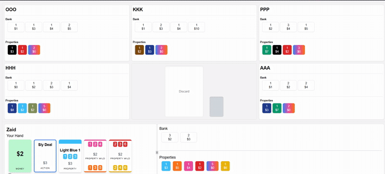
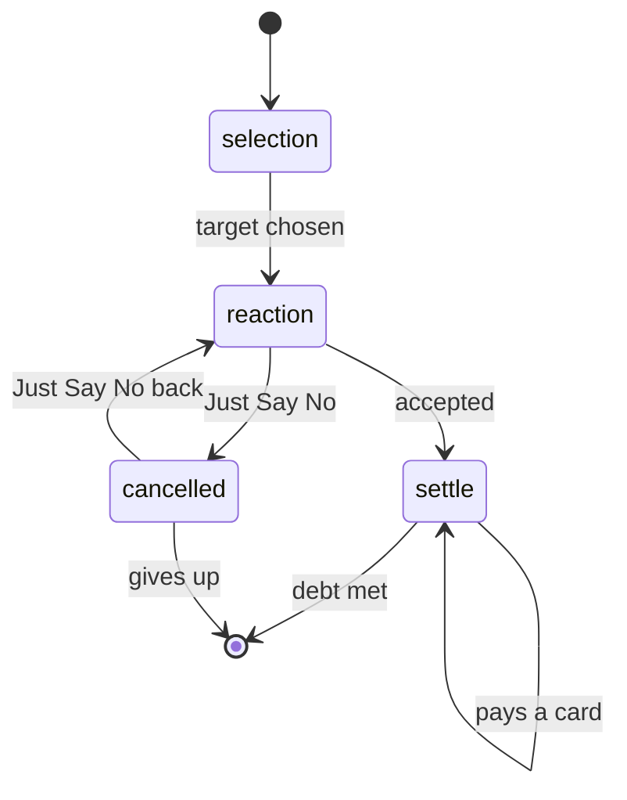
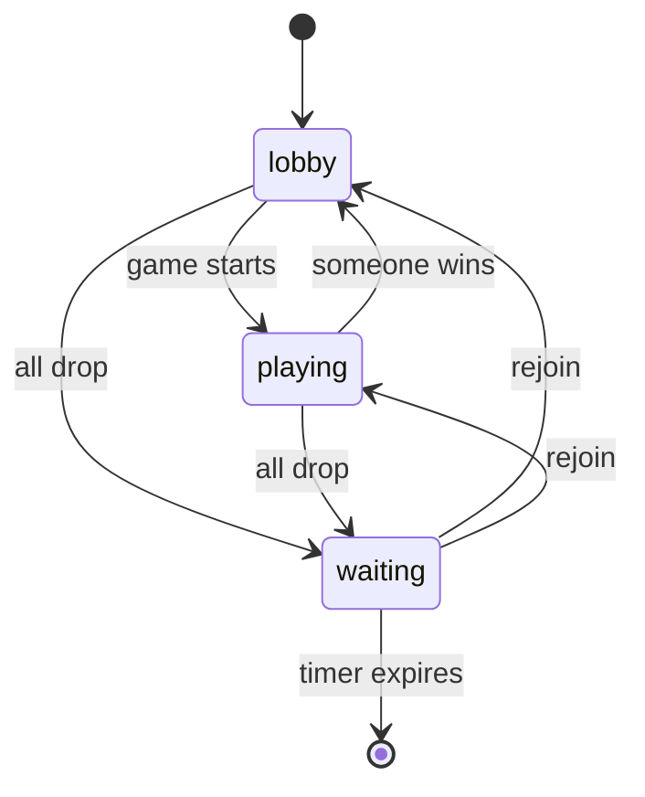
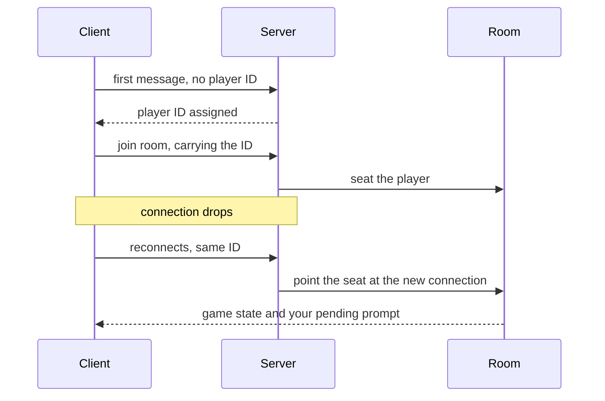

# Monopoly Deal

A multiplayer server for the card game Monopoly Deal. Create a room,
share a short code with friends, and play a full game over a WebSocket
connection.

The server keeps the whole game in memory and runs the rules itself. Players send
what they want to do, the server decides what actually happens and sends the
updated game back to everyone. Rules follow the standard ones from
[monopolydealrules.com](https://monopolydealrules.com/).



There is a mobile-responsive web client (PWA) for this server, shown above, in a
separate repository:
[monopoly-deal-client](https://github.com/muhammadzaid-99/monopoly-deal-client).

## What it does

- **Runs many games at once.** Rooms are independent, and a problem in one never
  reaches the others.
- **Handles the whole game.** All 106 cards for two to five players: properties,
  wildcards, money, rent, houses, hotels and every action card.
- **Keeps information private.** You get your own hand. Of everyone else you see
  only what you would see at a real table.
- **Handles cards that need a reply.** Rent, Just Say No and the rest pause the
  turn while the server collects answers.
- **Lets you organise your properties.** Build piles, move cards between them,
  recolour a wildcard pile. Tidying is free.
- **Survives players dropping out.** A disconnected player keeps their seat and
  cards, and can come straight back.

## How a turn works

| Step | What happens |
| --- | --- |
| Draw | 2 cards, or 5 if your hand is empty |
| Play | Up to 3 cards, into your bank, onto your properties, or as an action |
| Tidy | Rearrange property piles freely, at no cost |
| Discard | Down to 7 cards if you are holding more |
| End | Pass to the next player |

First player with three complete property sets wins.

Every play is checked first. No playing before drawing, no fourth card, no ending
your turn with too many cards, no acting on someone else's turn. An unplayable
card returns to your hand and the play is not spent.

## Properties, sets and rent

Sets are piles you build, not something worked out from the colours you own. This
matters for wildcards: the same card means different things depending on which
pile you put it in, so the pile is the thing that is owned. Rent is recalculated
whenever a pile changes.

| Pile state | Rent |
| --- | --- |
| Incomplete | Rent for the number of cards it holds |
| Complete | Full set rent |
| Complete with house | Set rent plus 3 |
| Complete with hotel | Set rent plus 7 |

- A house needs a completed set, a hotel needs a house.
- Neither goes on railroads or utilities.
- A completed set takes no further property cards.
- Cards played without a destination sit loose until you file them.
- Empty piles are cleared at the end of your turn.

## Paying

- You choose which cards to hand over, one at a time, from your bank or
  properties.
- No change is given, so overpaying is your own problem.
- If you cannot cover it, you pay what you can and the debt closes there.
- Money and action cards go into the other player's bank, properties onto their
  board.
- Just Say No cancels the demand, but only before your first card is handed over.

## Cards that need a reply

Six cards cannot resolve on their own, because another player has to be given a
chance to respond. Each runs as a small state machine that holds the game until
it finishes.

| Card | What the server arranges |
| --- | --- |
| Deal Breaker | Pick an opponent and a completed set, then let them refuse |
| Sly Deal | Pick a property from an incomplete set, then let them refuse |
| Forced Deal | Pick a property from each side to swap, then let them refuse |
| Debt Collector | Pick one opponent, then collect 5 |
| It's My Birthday | Collect 2 from every other player |
| Rent | Choose a set and, depending on the card, one opponent or all |

All follow the same shape, and the game sits in that shape until it resolves:



Two loops in there are the whole point. Just Say No bounces between `reaction`
and `cancelled` for as long as both players keep producing one, and payment stays
in `settle` until the debt is met or the payer runs dry. Neither needed a special
case: they are the same step repeating.

While a pending action is open every message from a player is routed into it, so
nobody can play on while a payment is outstanding. Debts are tracked per player,
which is how Birthday and a two colour Rent walk several opponents through
`settle` at once, in whatever order they answer.

Double The Rent works the same way. It is not an effect of its own, it reaches
into the rent already waiting in `settle` and doubles it.

## Rooms and their lifecycle

A new room gets a six digit code, checked against running rooms so two games
never share one. Up to five players join, everyone readies up, and any player can
start.

Rooms clean up after themselves. No sweeping job, no manual teardown.



A room in `waiting` is still whole. Nothing is thrown away until the timer
actually runs out, so a reconnection puts everyone back exactly where they were.

| Situation | What happens |
| --- | --- |
| Somebody is still connected | Room stays |
| Everyone gone, no players seated | Deleted after 2 minutes |
| Everyone gone, players still seated | Deleted after 20 minutes |
| Anyone joins or reconnects | Countdown cancelled |

The split is deliberate: an empty lobby is worth forgetting quickly, a real game
where everyone lost signal deserves a generous window.

Leaving in the lobby releases your seat. Leaving mid-game counts as a
disconnection, so your cards stay on the table.

## Players and reconnecting

The server hands out identity instead of trusting the client for it. Your first
message gets you a player ID, recorded against your connection and address, which
your client then sends with everything. That is what stops one player acting as
another by claiming their ID.

Since identity is not the socket, losing the socket costs nothing:



- A known player arriving on a new connection is recognised and reseated.
- An address change, such as wifi to mobile data, is read as a reconnection
  rather than a stranger.
- The last thing the server asked of you is remembered, so dropping out midway
  through paying rent returns you to that request, not a frozen board.

## How it is built

Go, with [gws](https://github.com/lxzan/gws) for WebSockets. No database.
Everything lives in memory for as long as the room does.

### One room, one goroutine

Connections are read on their own goroutines, so players in the same game send at
the same instant. Locking game state everywhere gets unpleasant when one action
moves cards between four players.

Instead each room owns a goroutine and an event queue. Connections never touch
game state; they queue a message and move on, and the room handles them one at a
time in arrival order. Only one thing happens to a game at once, so the game
logic reads like single player code. Callers needing an answer, such as a join,
send a reply channel with the event.

This is also the failure boundary. A room that panics recovers, logs, and hands
its ID to a cleanup worker that frees it. One game disappears, the rest of the
server carries on.

### Changing state safely

Moving a card means finding it, checking the move is legal, then removing it.
Done in one pass, you risk pulling a card out and finding afterwards that the
move was not allowed.

So lookups return the card plus a commit function. The caller inspects what it
found and commits only when sure. The commit runs once, clears the pile if it is
now empty, and recalculates rent. Playing a card works the same way: it leaves
your hand first, and an illegal play puts it straight back without spending a
play.

### The deck

Built once per game from the card groups and shuffled. The 106 cards are numbered
from 1 as the deck is assembled, and that number is all the client ever sends to
name a card. Zero is never used, so a missing ID cannot mean a real card.

When the draw pile runs out the discard pile is shuffled back in, minus the top
card, which stays visible.

## Talking to the server

JSON with a type on it, both directions, one connection per player.

| The client sends | For |
| --- | --- |
| `create-room`, `join-room` | Getting into a game |
| `change-ready-state`, `start-game` | The lobby |
| `draw-cards`, `play-card`, `end-turn` | Taking a turn |
| `arrange-property`, `create-pile`, `change-pile-color` | Organising your board |
| `discard-card` | Getting back to seven cards |

The same messages carry replies to a waiting card, so there is no separate
vocabulary for answering Rent or choosing who to take a set from.

| The server sends | What it contains |
| --- | --- |
| Your hand | Only ever your own cards |
| Player list | Everyone's name, bank, properties and hand size |
| Game info | Whose turn, plays left, top of the discard pile, recent events |
| Your prompt | What you are expected to do right now |

All of it goes out together on any change, rather than a description of what
changed. Slightly more traffic, but the client cannot drift out of step: it draws
whatever arrived last, and a missed message is fixed by the next one.

## Running it

Go 1.24 or newer.

```sh
go run .
```

Listens on `PORT`, or 8080 if unset. On Windows, `run.bat` builds and starts it
in one step.

## Project layout

| Files | What is in them |
| --- | --- |
| `main.go` | Starting the server |
| `gws-main.go`, `gws-game.go` | Connections, player identity, room event loop |
| `room.go`, `room-manager.go` | Rooms, turns, sending game state to players |
| `action.go`, `action-resolver.go` | Action cards and the ones that need a reply |
| `models/cards` | The cards and the deck |
| `models/game` | Game state, players, property piles and rent |
